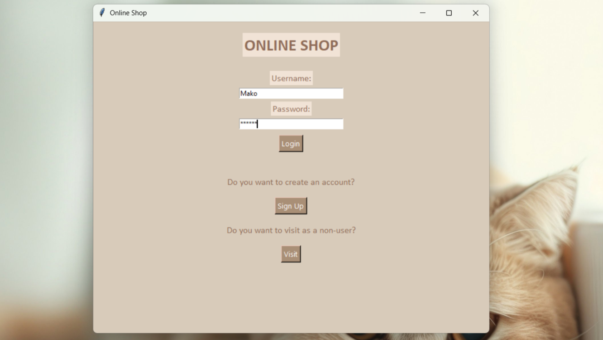
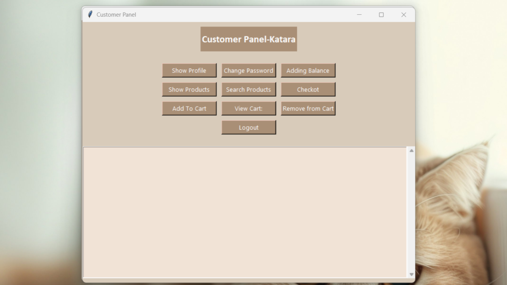
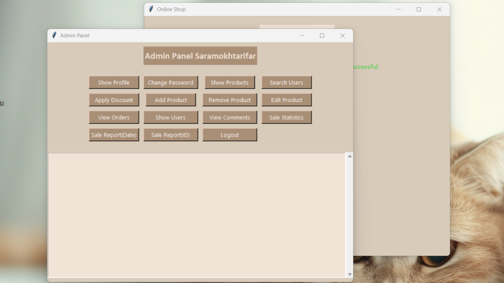
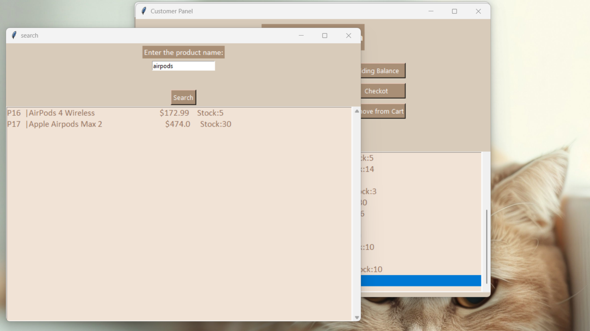
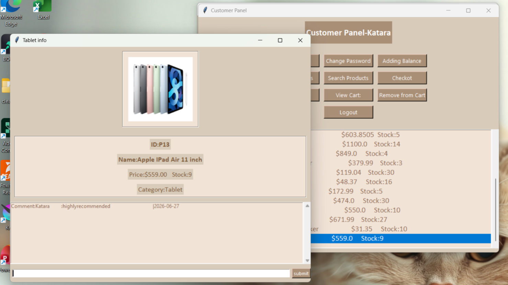
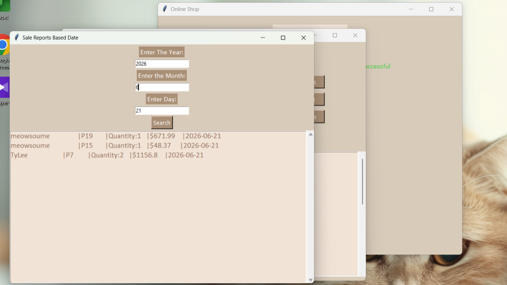
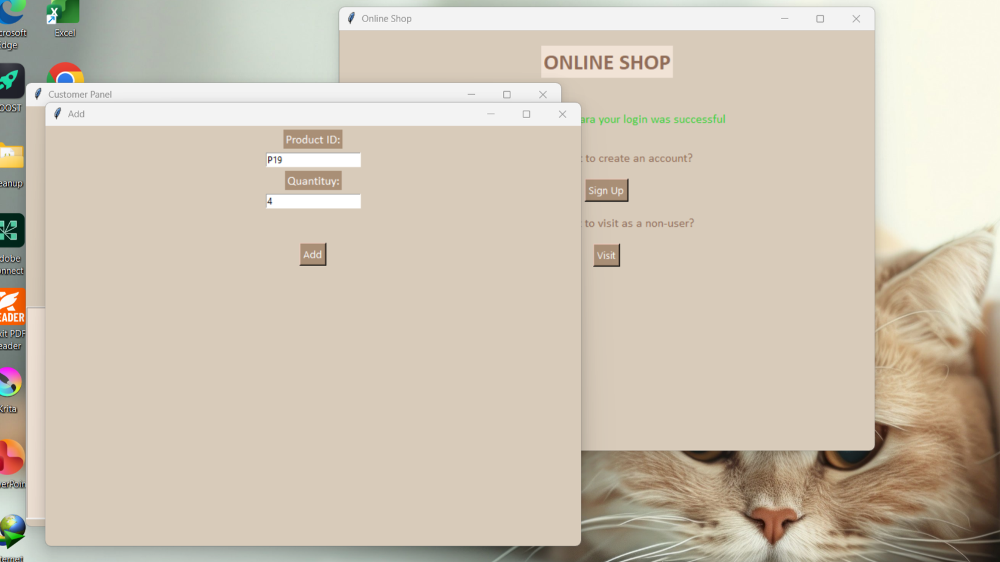

# 🛒Online Shop Project (Python + Tkinter)
## 📌Description
This is a simple **online shop management system** developed in Python as part of an **AP (Advanced Programming)course project**. The project uses **Tkinter for GUI** and **CSV files for data storage**.
---
## ✨Features

### 👤Customer Features
- View and search products
- Add products to shopping cart
- Remove items from cart
- Checkout system
- View profiles (balance, cart summary)
- Add comments on products
- View product details (including images)

### 🛠️ Admin Features
- Add, edit, and remove products
- View users and orders
- View product comments
- Apply discounts to products
- Sales report (by product / date)

## 📁 Project Structure

```
project/
├── main.py
├── gui.py
├── models.py
├── products.csv
├── users.csv
├── orders.csv
├── comments.csv
└── images/
```
## Status
Project is under development

## Technologies Used
- Python 3.x
- Tkinter (GUI)
- CSV file handling
- Pillow (PIL) Library for image handling

## Installation
````bash
pip install pillow
````
## Author
Developed by Sara Mokhtari Far

- Course: Advanced Programming (AP)
- Language: Python
- GUI Framework: Tkinter
- Year: 2026
- GitHub: @saramokhtarifar
- Repository: https://github.com/saramokhtarifar/online-shop-python

## Screenshots
### Login Page

### Customer Panel

### Admin Panel

### Product Search

### Product Info

### Sale Statistics

### Add To Cart
